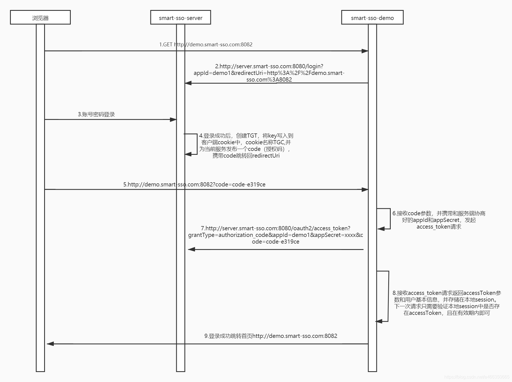
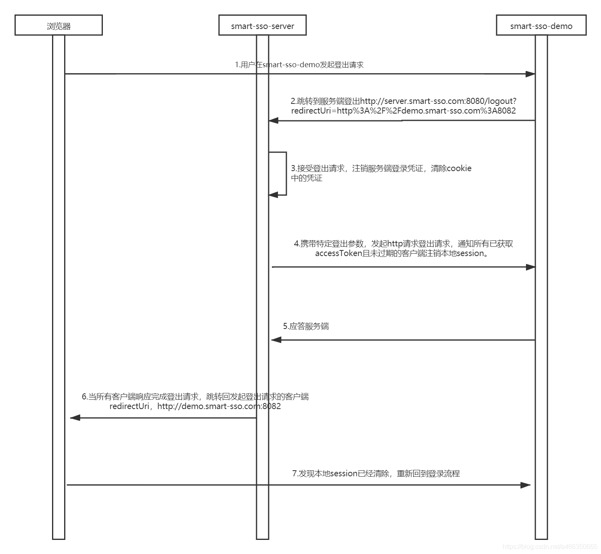
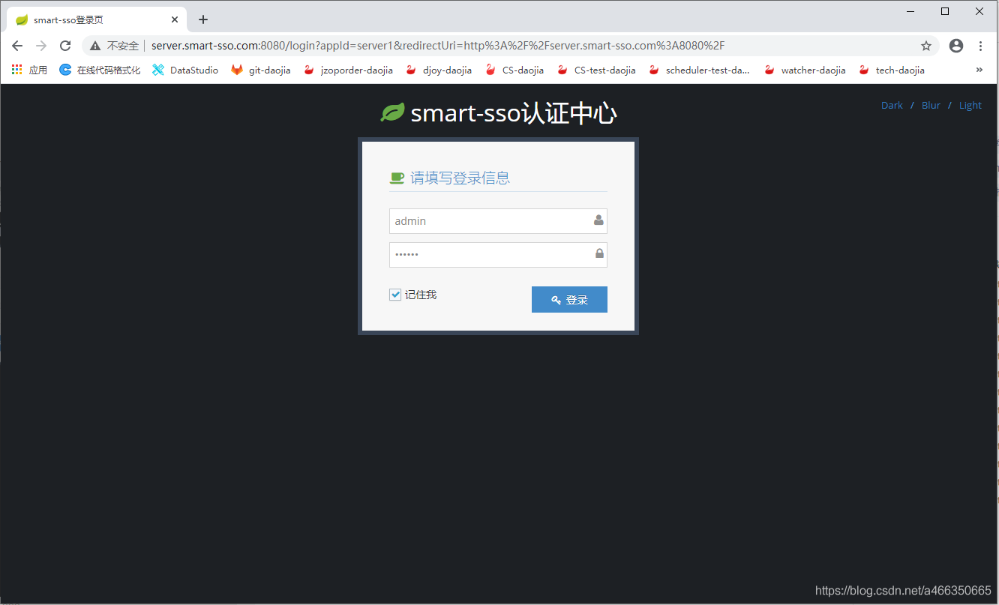
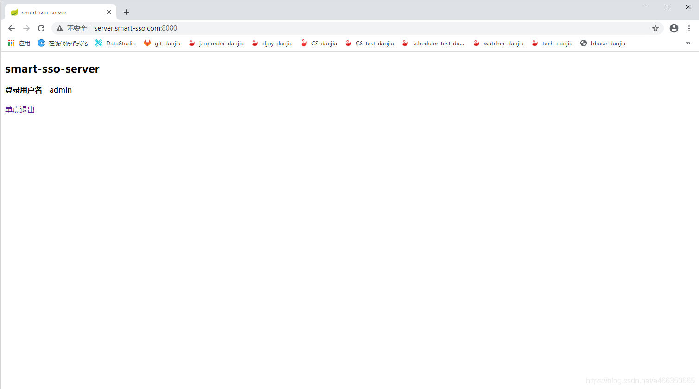
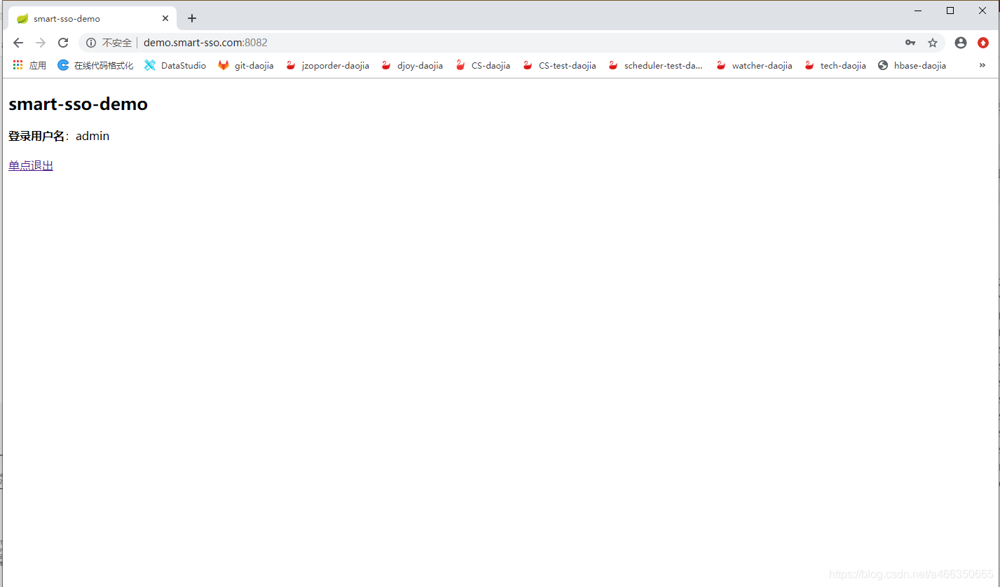

# 开源地址

```
https://github.com/a466350665/smart-sso
https://gitee.com/a466350665/smart-sso
QQ交流群：454343484🈵、769134727
```

# 简述
> smart-sso使用当下最流行的SpringBoot技术，基于OAuth2认证授权协议，为您构建一个易理解、高可用、高扩展性的单点登录应用基层。

# 组织结构
```
smart-sso
├── smart-sso-client -- 客户端依赖包
├── smart-sso-client-redis -- 客户端依赖包，分布式redis支持
├── smart-sso-demo -- 客户端
├── smart-sso-server -- 服务端
```

## 单点登录原理



# 单点退出原理



## 效果展示

### 单点登录页



### 服务端登录成功页



### 客户端登录成功页

