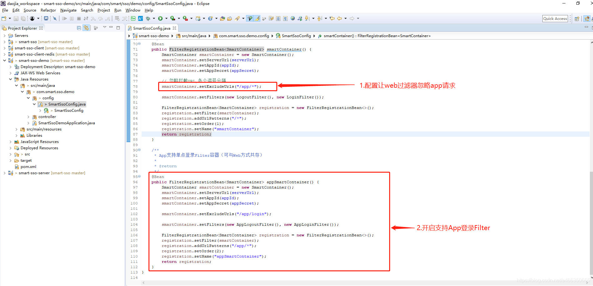
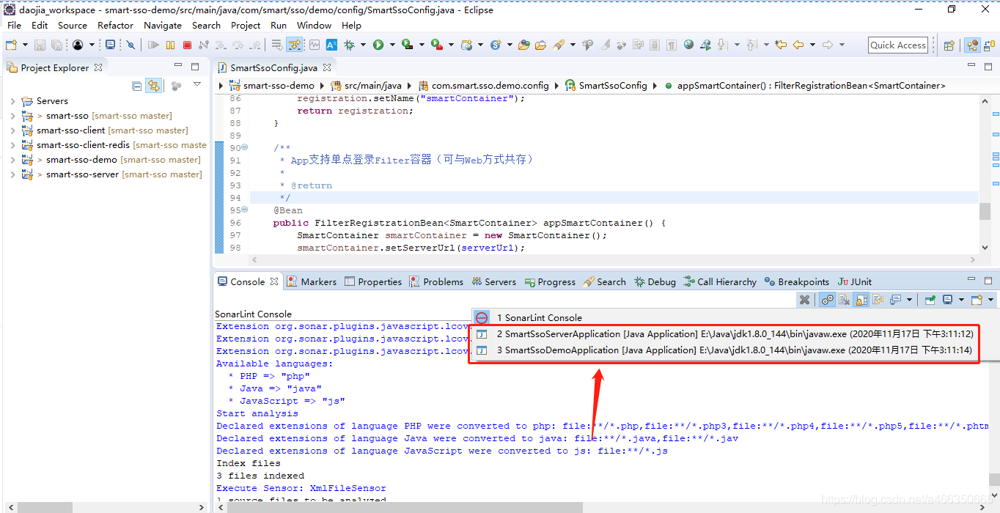
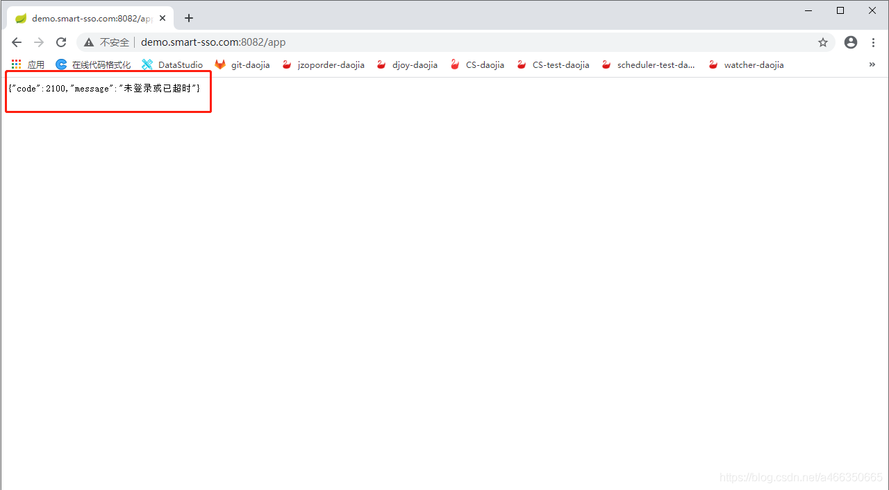
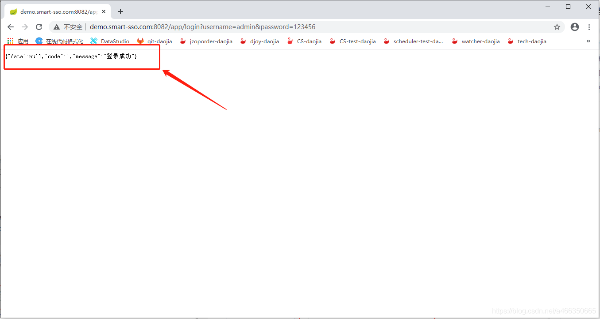
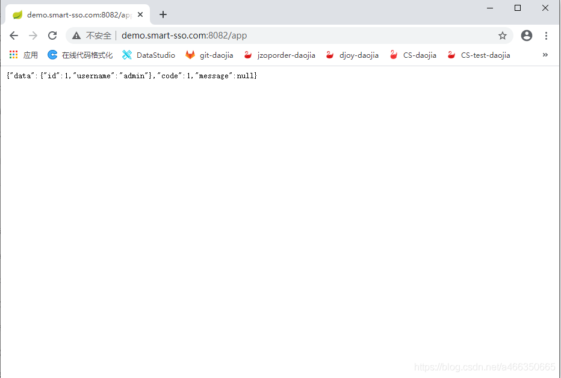

# 前言
```
smart-sso使用Oauth2密码模式由客户端代理转发http请求到服务端完成APP登录认证。客户端后端本地存储服务端返回的accessToken和Session映射关系。需注意的地方如下：
1.app中发起的所有ajax请求，需携带后端返回的cookie，即JSESSIONID进行访问
2.登录操作是由客户端前端应用（Android、IOS等）提交表单到客户端后端，通过客户端后端代理转发http请求到服务端认证，这样Oauth2协议中所需的应用密钥信息（appId、appSecret）保存在客户端后端，即登录细节在后端完成，减少安全隐患
```

# 配置修改
a.修改客户端smart-sso-demo配置文件SmartSsoConfig。如下图所示：



**注**：smart-sso-demo假定所有/app/*请求都需要登录认证才正常返回

## 验证

a.分别启动服务端smart-sso-server和客户端smart-sso-demo实例。如下图所示：



b.浏览器代替app访问需登录后可查看的get请求http://demo.smart-sso.com:8082/app，客户端后端返回如下未登录Json信息



c.浏览器模拟app发起登录请求。发起http://demo.smart-sso.com:8082/app/login?username=admin&password=123456请求，后端返回如下成功登录Json：



**注**：此过程意为模拟app中表单登录，当然这里只是username、password方式。相应的修改为手机号登录也是同理。

d.再重新验证http://demo.smart-sso.com:8082/app资源接口，数据成功返回

