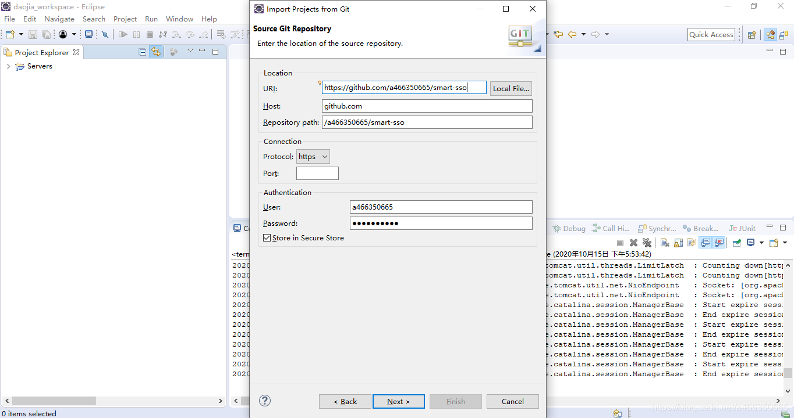
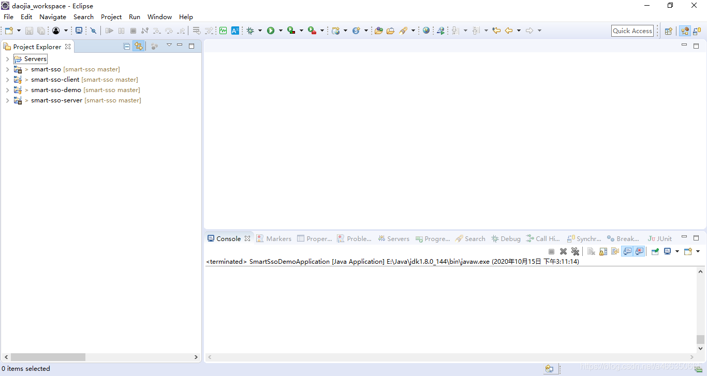
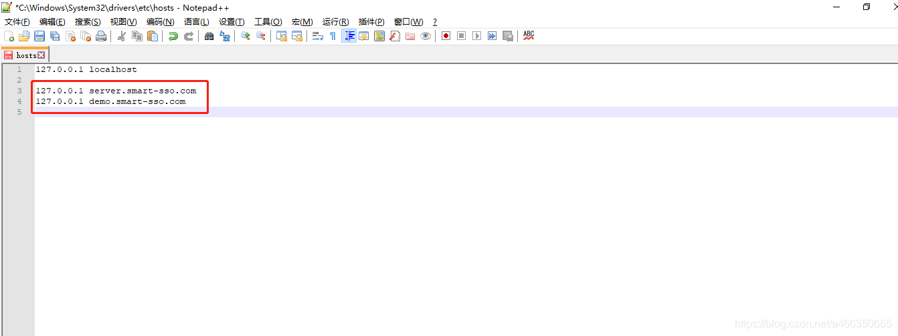
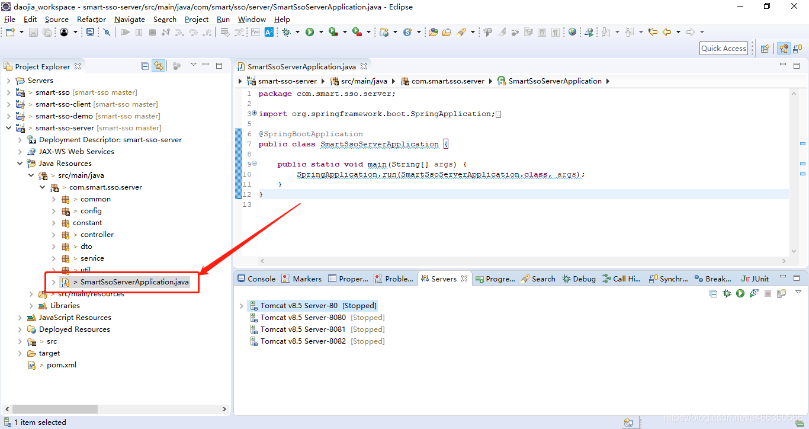
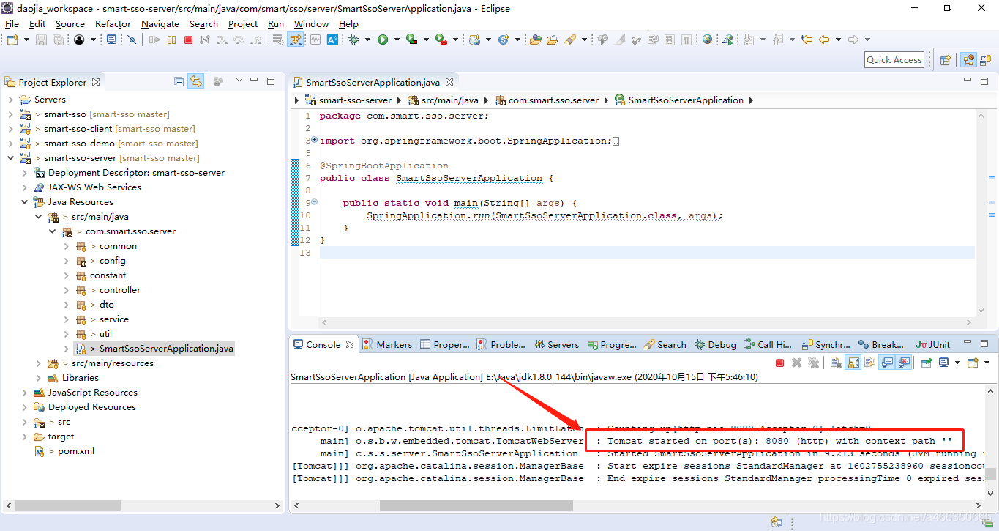
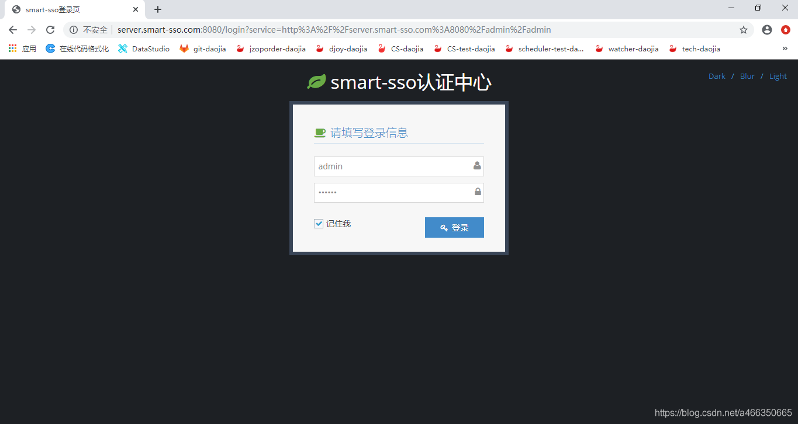
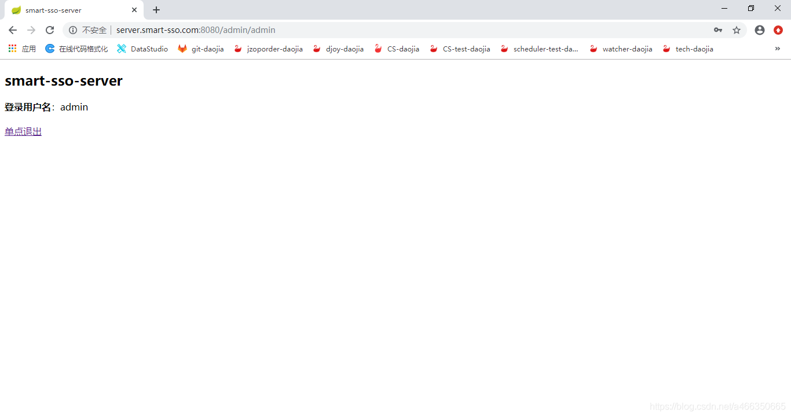
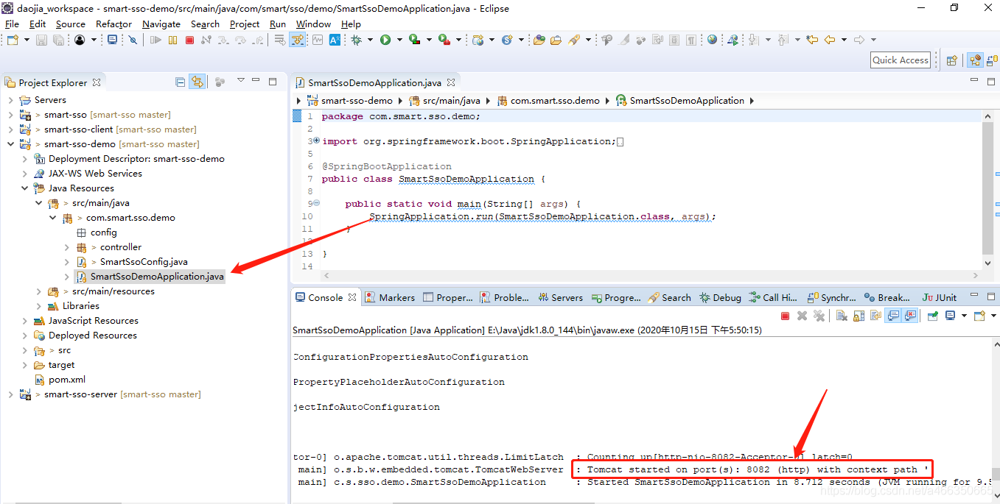
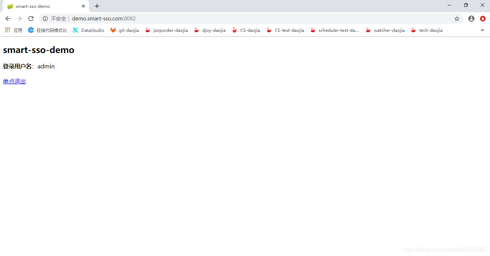

## 前言

以eclipse为例，导入并分别运行smart-sso服务端和客户端，展示验证单点登录功能。

## 1.项目导入

### a.smart-sso从github上导入，地址: https://github.com/a466350665/smart-sso



## b.完成后如下图所示：



## 2.修改hosts文件

a.找到C:\Windows\System32\drivers\etc\hosts文件，增加域名本地映射。

```
127.0.0.1 server.smart-sso.com
127.0.0.1 demo.smart-sso.com
```



## 3.部署运行

a.找到服务端启动类，启动服务端。如下图所示，服务启动完成并成功运行在8080端口上。





c.服务端验证，浏览器访问：http://server.smart-sso.com:8080自动跳转至登录页，默认的账号密码是：admin 123456，登录成功后进入到服务端首页。





e.客户端验证，浏览器访问：http://demo.smart-sso.com:8082，直接进入到smart-sso-demo首页，完成单点登录。可以顺带测试一下单点登出功能，作者这里就不展示。

