# 前言
```
smart-sso使用SpringSession方式引入redis接管HttpSession，来实现分布式环境session共享。同时借助nginx反向代理实现单域名转发到后端多实例，实现负载均衡。

项目环境搭建前，你需要在本地准备redis和nginx环境，为方便起见都使用windows版本
redis下载地址：https://github.com/MicrosoftArchive/redis/releases
nginx官网下载地址：http://nginx.org/en/download.html
```

# 1.服务端配置
a.pom.xml文件，修改jar包smart-sso-client为smart-sso-client-redis。
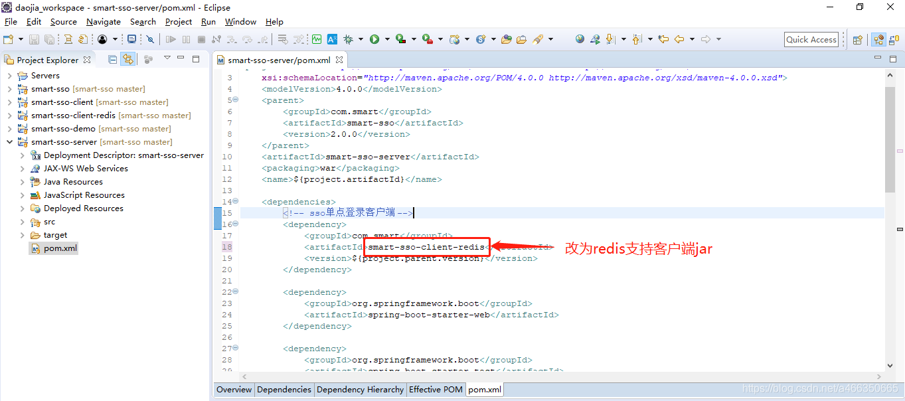

b.application.properties文件，去除服务端地址域名后的8080端口，开启redis连接配置，并修改连接及session配置。

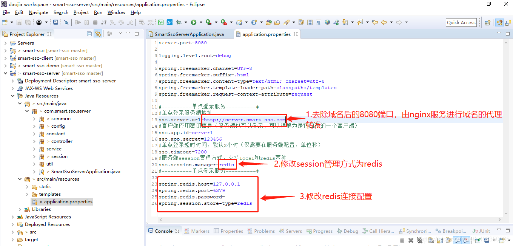

c.启动类SmartSsoServerApplication，开启使用Spring管理的RedisSession接管HttpSession，并让redis实现启动装配。

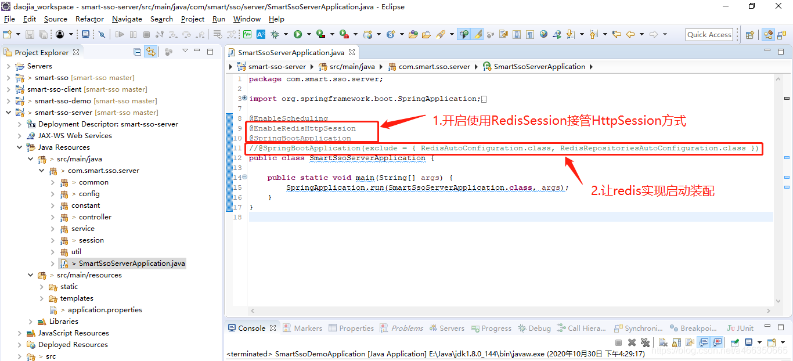

d.修改配置类SmartSsoConfig。

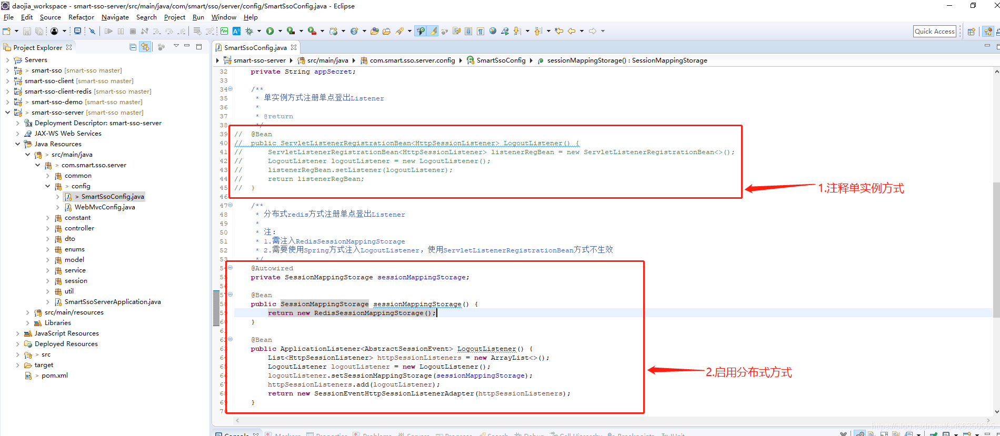

e.运行SmartSsoServerApplication，启动服务端8080实例。

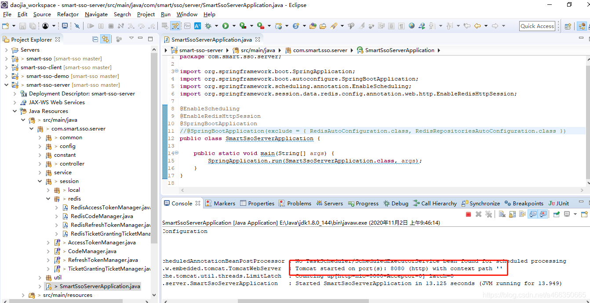

f.修改端口号为8081，启动服务端8081实例。

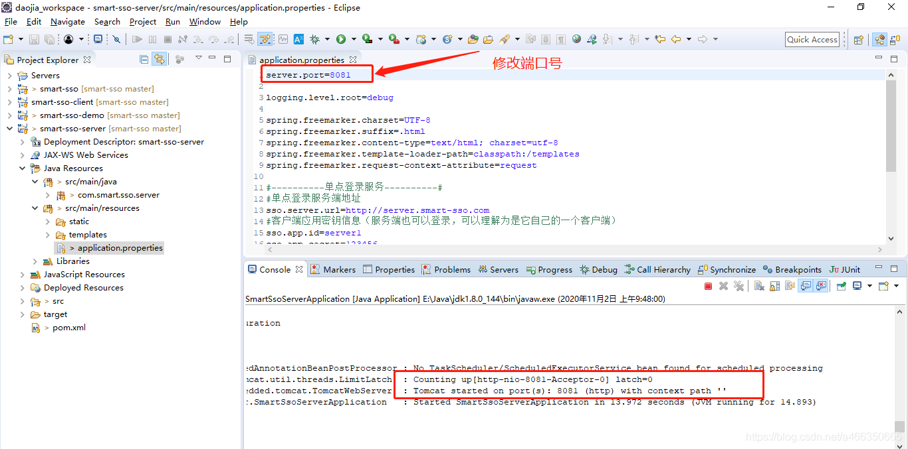

## 2.客户端配置

a.pom.xml文件，改smart-sso-client为smart-sso-client-redis，并引入支持redis的客户端jar。

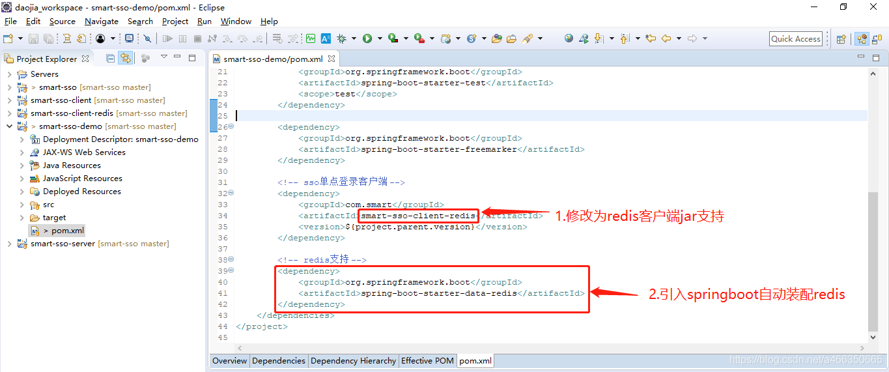

b.application.properties文件，修改服务端地址，开启redis连接配置。

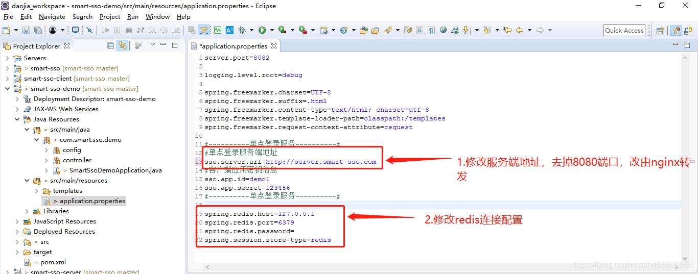

c.启动类SmartSsoDemoApplication，开启使用Spring管理的RedisSession接管HttpSession，并让redis实现启动装配。

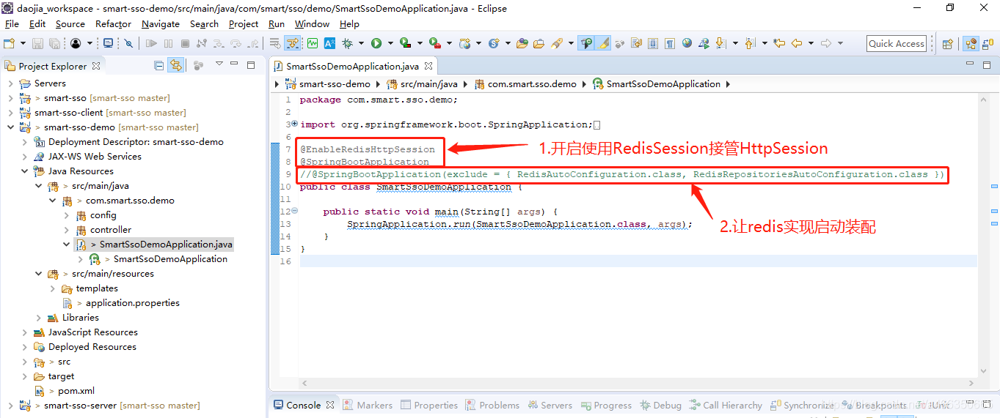

d.同理，修改配置类SmartSsoConfig。


e.运行SmartSsoDemoApplication，启动客户端8082实例。

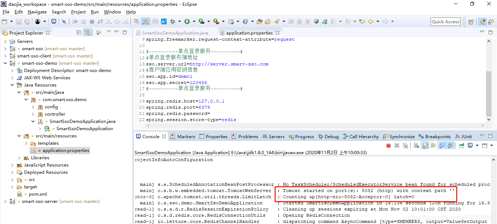

f.修改端口号为8083，启动客户端8083实例。

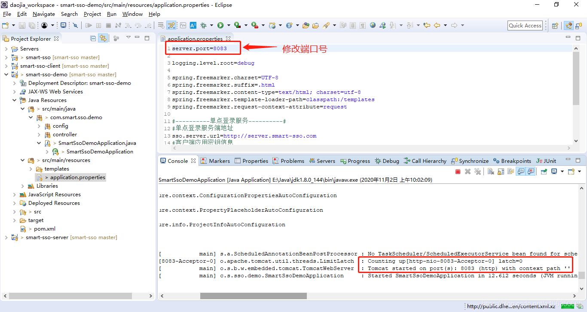

3.nginx配置
a.找到E:\SoftWare\nginx-1.12.2\conf\nginx.conf配置文件，分别增加代理转发配置，让域名server.smart-sso.com转发到本地的8080和8081端口，让demo.smart-sso.com转发到本地的8082和8083端口。如下图所示：

```
upstream demoServers {
    server localhost:8082;
    server localhost:8083;
}

server {
    listen       80;
    server_name  demo.smart-sso.com;

    location / {
        proxy_pass http://demoServers;
        proxy_set_header Host $host;
        proxy_set_header X-real-ip $remote_addr;
    }
}

upstream serverServers {
    server localhost:8080;
    server localhost:8081;
}

server {
    listen       80;
    server_name  server.smart-sso.com;

    location / {
        proxy_pass http://serverServers;
        proxy_set_header Host $host;
        proxy_set_header X-real-ip $remote_addr;
    }
}
```

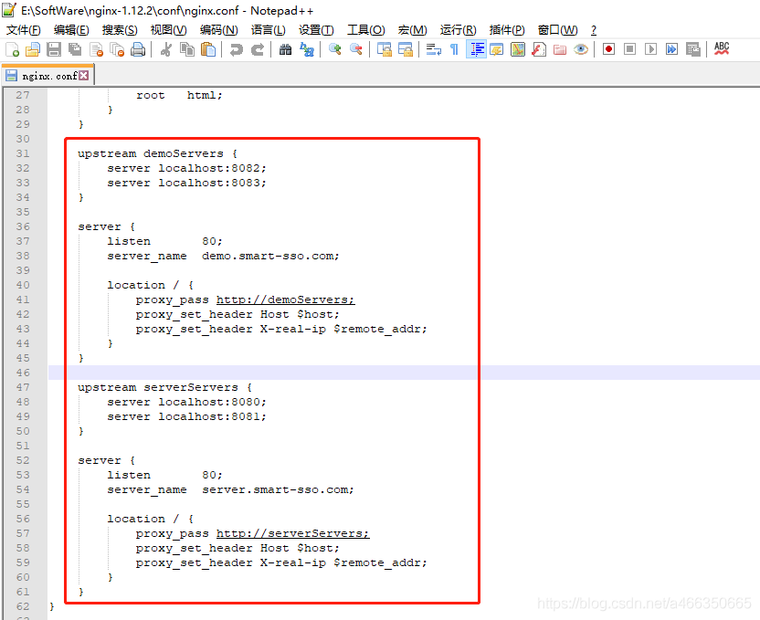

b.启动/重启nginx
start nginx
nginx -s reload

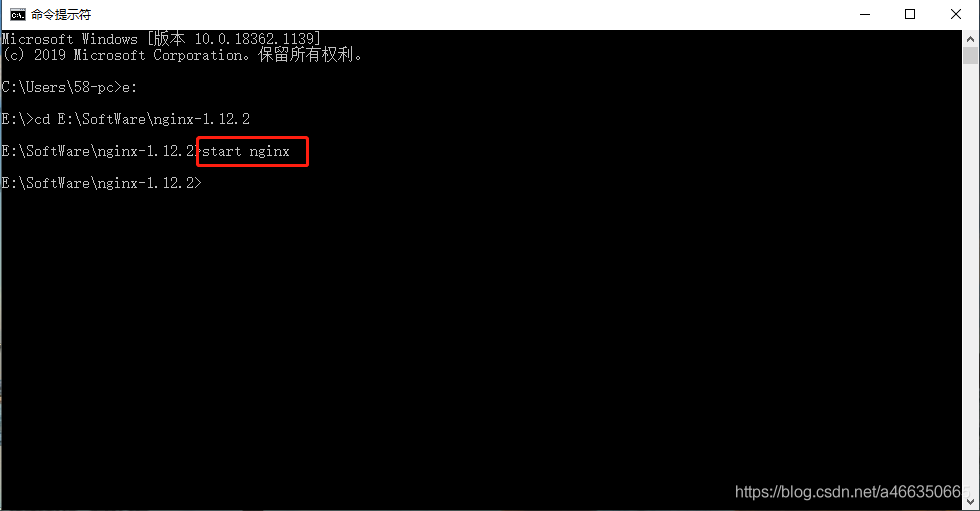

4.验证
a.服务端验证，浏览器访问http://server.smart-sso.com，完成后登录，进行多次页面请求刷新。可以看到端口8080和8081交替访问，且sessionId不变。说明域名已正常转发到8080和8081两个实例，且session已通过redis实现共享。

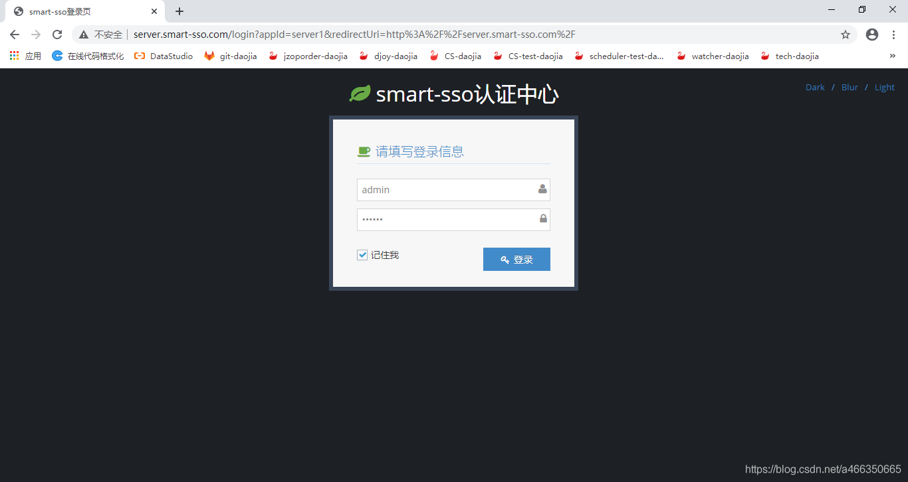

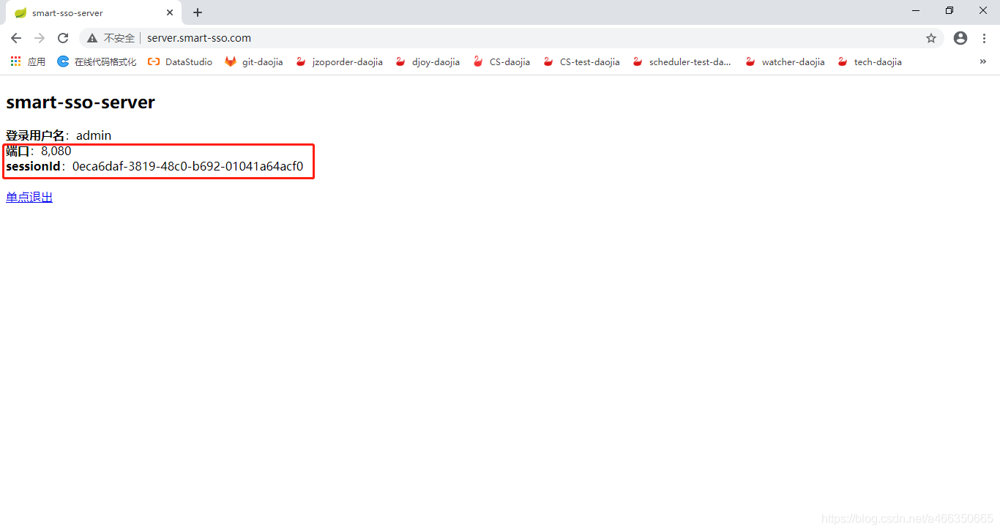


b.客户端验证，浏览器访问http://demo.smart-sso.com，直接跳过了登录，访问到主页。并进行多次页面请求刷新，可以看到端口8082和8083交替访问，且sessionId不变。域名已正常转发且session实现共享。


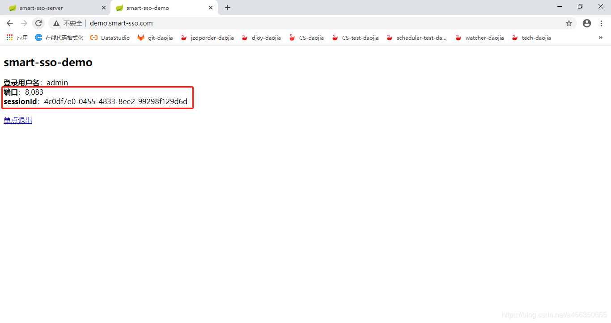